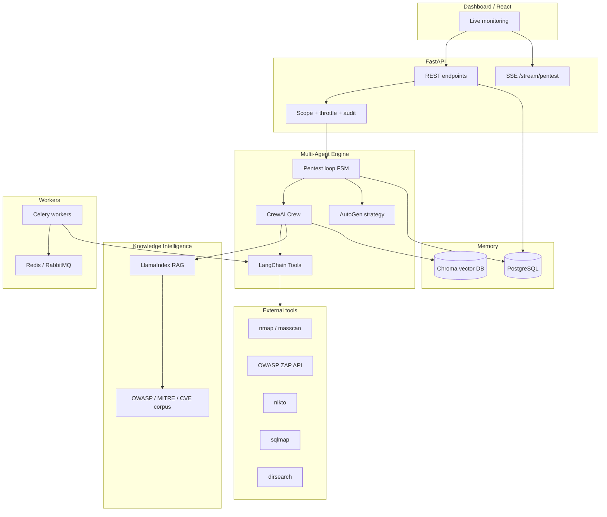

# AI Pentest Platform — System Architecture

## Overview

This platform layers **LangChain tools**, **CrewAI multi-agent crews**, **AutoGen strategy reasoning**, **LlamaIndex RAG**, and **OpenAI** models on top of a **FastAPI** control plane with **PostgreSQL** (operational state), **Chroma** (vector memory), **Redis** (throttling + Celery result backend), and optional **RabbitMQ** (Celery broker). Scanners (Nmap, ZAP, Nikto, SQLmap, Dirsearch, etc.) are invoked through a **tool integration layer** with subprocess isolation and configurable **safe exploit mode**.

## High-level diagram

## Autonomous pentesting loop

The finite-state loop (`pentest_platform.core.pentest_loop`) advances:

1. **Discover** attack surface (Recon agent + passive/tool-assisted mapping)  
2. **Scan** target (Network + Web agents)  
3. **Analyze** vulnerabilities (API agent + LlamaIndex context)  
4. **Plan** next steps (Strategy agent + AutoGen planner)  
5. **Execute** targeted tests (Exploit analysis agent — **safe mode** limits destructive tooling)  
6. **Evaluate** results (Reporting agent + attack path engine)  
7. **Iterate** until coverage threshold or max iterations  

Shared memory lives in `PentestSessionState.agent_memory` and is summarized into PostgreSQL session rows.

## Attack path engine

`pentest_platform.core.attack_path_engine` builds a **NetworkX** directed graph from observations (ports, services, vulns, exploits) and ranks simple paths between sources and sinks by weighted risk.

## Extension hooks

`pentest_platform.core.hooks` exposes:

- `register_tool(name, factory, description)` — LangChain-compatible tools  
- `register_agent(name, factory, role)` — custom agent factories for future Crew wiring  
- `register_scanner(name, factory, category)` — metadata for external scanner plugins  

`pentest_platform.plugins.bootstrap.register_builtin_plugins()` loads defaults at API startup.

## Security controls

| Control | Implementation |
|--------|------------------|
| Target scope | `security/scope.py` — host allowlist / CIDR |
| Authorization | `X-API-Key` header (`API_KEYS` env) |
| Throttling | Redis sliding window per key (`security/throttle.py`) |
| Audit | `audit_logs` table (`security/audit.py`) |
| Safe exploit | `SAFE_EXPLOIT_MODE` gates SQLmap and similar tools |

## Horizontal scaling

- **API**: stateless; run multiple replicas behind a load balancer; align `API_KEYS`, DB, Redis, and Chroma paths.  
- **Workers**: Celery workers consume `pentest.run_shell_scan` and related tasks; scale `worker` service replicas.  
- **SSE**: current in-memory bus is single-process; for multi-API-node deployments, replace `EventBus` with Redis pub/sub.

## Integration with existing systems

- **REST**: all control and read APIs under `/start-pentest`, `/stop-pentest`, `/pentest-status`, `/vulnerabilities`, `/attack-paths`, `/agent-logs`, `/dashboard-summary`.  
- **Events**: `GET /stream/pentest` for React dashboards.  
- **Plugins**: register tools/agents/scanners and optionally call Celery from your bridge service.
